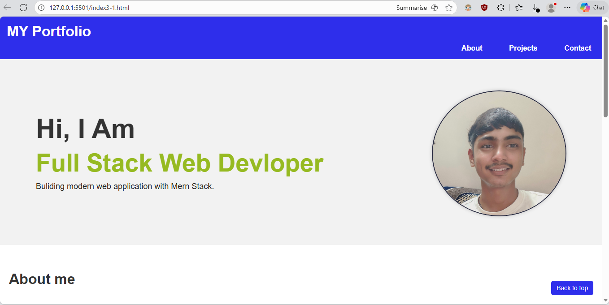

# Karan’s Personal Portfolio Website

This is a simple portfolio website created using only **HTML and CSS**.  
It showcases my personal profile, skills, projects, and contact details.  
This project is developed as a part of **CSDF Assignment 4** where we must build a mini-project using VS Code, Git, and GitHub.

---

## 🔹 Project Overview

- Fully static portfolio website  
- Built with clean & minimal HTML/CSS  
- Contains profile section, skills, project showcase, and contact info  
- Includes one of my projects (Calorie Tracker) displayed inside the website  
- Designed & tested using **Visual Studio Code**

---

## 🔹 File Structure

```
CSDF-AS-4-portfoliowebsite/
 ├─ index3-1.html
 ├─ html3-1.css
 ├─ profilephoto.jpg
 ├─ calorietracker-ss1.png       ← Project image shown inside portfolio
 ├─ calorietracker-ss2.png       ← Project image shown inside portfolio
 ├─ homepage-sss.png.png         ← Screenshot of my portfolio homepage
 ├─ portfolio-section.png.png    ← Screenshot of About/Projects section
 ├─ README.md
 └─ docs/
      ├─ overview.md
      ├─ development-process.md
      └─ future-improvements.md
```

---

## 🔹 Screenshots of the Portfolio Website

### 🟦 Home Page


### 🟪 Main Section (About / Skills / Projects)


---

## 🔹 Features

- Clean homepage with profile photo  
- Section-based layout (About, Skills, Projects)  
- Images included for my featured project  
- Works locally on any browser  
- Simple and beginner-friendly design  

---

## 🔹 How to Run the Project

1. Download or clone the repository  
2. Open the project folder  
3. Double-click on **index3-1.html**  
4. The website opens directly in your browser  
(No server required)

---

## 🔹 Tools Used

- **Visual Studio Code** for coding  
- **Git & GitHub** for version control  
- **HTML5**  
- **CSS3**

---

## 🔹 Documentation

Full documentation is inside the `/docs` folder:

- `overview.md` — What the project is about  
- `development-process.md` — How I created the project  
- `future-improvements.md` — What I plan to add next  

---


---

## 🔹 Developer

**Karan Singh Negi**  
GitHub: [karan-singhnegi01](https://github.com/karan-singhnegi01)

